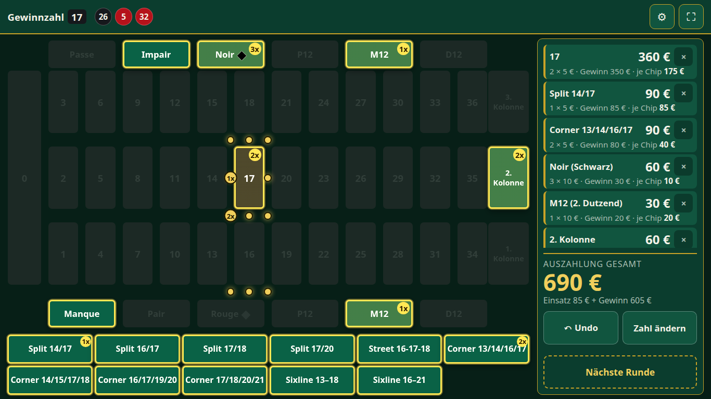
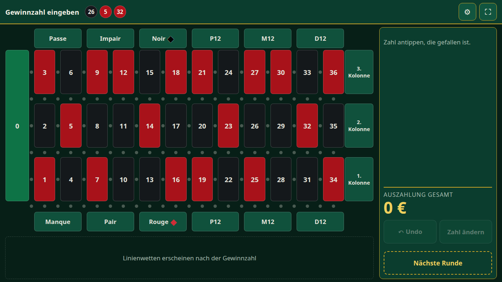
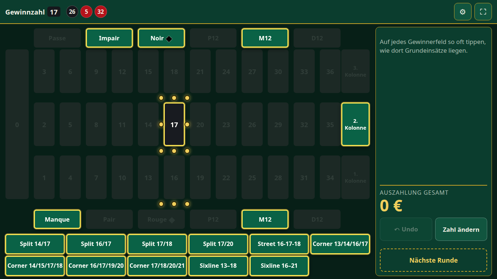
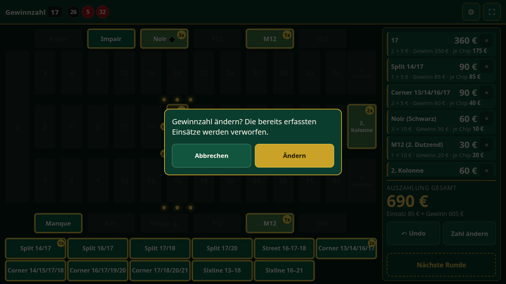
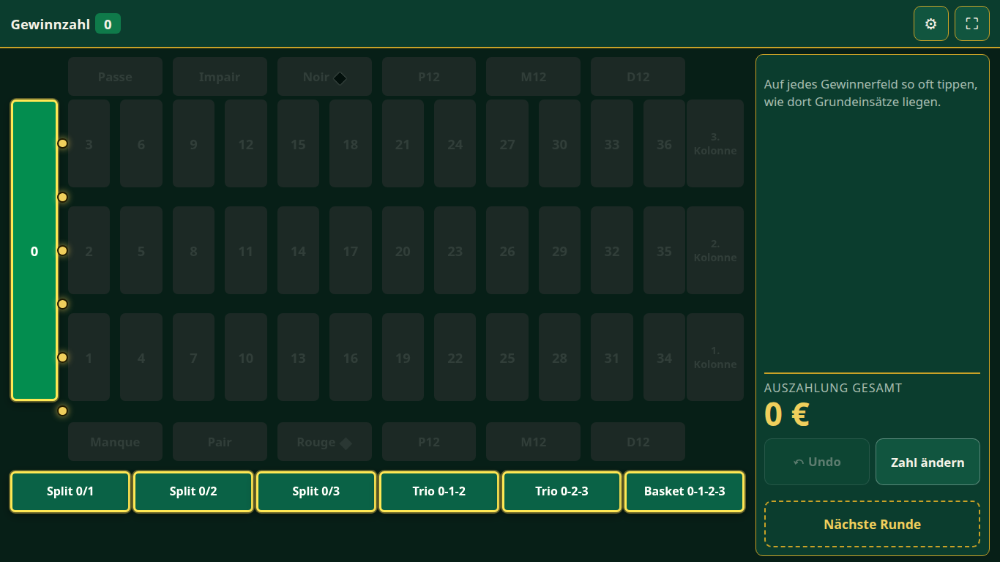
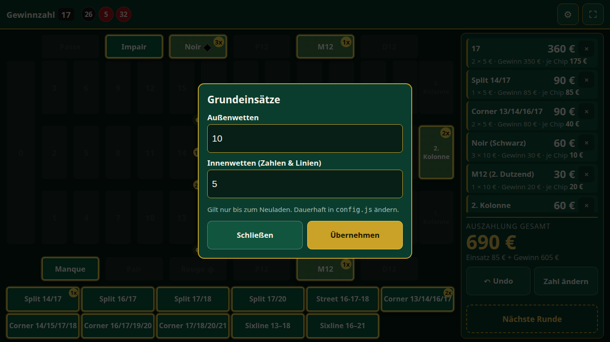
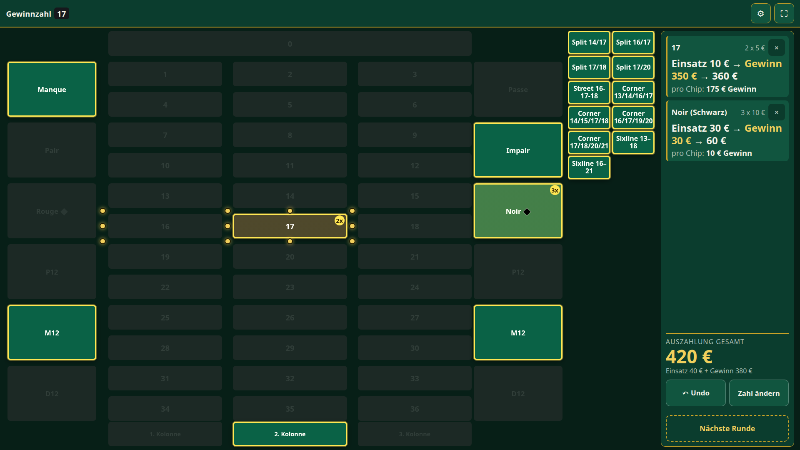

# Roulette Dealer Companion

Eine kleine Web-App, die einem Laien-Dealer auf einer privaten Roulette-Party (Spielgeld, echte Jetons) das Rechnen abnimmt. Der Dealer gibt **nach** dem Wurf die Gewinnzahl ein; die App hebt genau die Felder hervor, die gewinnen, sperrt alle verlierenden Felder – ein verlorener Einsatz lässt sich also gar nicht erst erfassen – und zeigt für jedes belegte Feld Einsatz, Gewinn, Auszahlung und **Gewinn pro Chip** sowie die Gesamtauszahlung der Runde.

Linienwetten (Split, Street, Corner, Sixline sowie Trio und Basket an der Null) sind dabei: Man tippt sie direkt auf der Linie zwischen den Zahlen an oder wählt sie aus einer Liste, die nur die gewinnenden Linien enthält.

Kein Backend, keine Datenbank, keine Accounts, keine Speicherung. Nichts verlässt den Browser.



---

## Inhalt

- [Schnellstart](#schnellstart)
- [Anleitung für den Dealer](#anleitung-für-den-dealer)
- [Konfiguration](#konfiguration)
- [Auf Tablet und Laptop](#auf-tablet-und-laptop)
- [Hausregeln & Quoten](#hausregeln--quoten)
- [Für Entwickler](#für-entwickler)

---

## Schnellstart

```bash
docker compose up -d
```

Danach im Browser öffnen:

- am Rechner selbst: `http://localhost:8080`
- am Tablet im selben WLAN: `http://<LAN-IP-des-Rechners>:8080`

Stoppen:

```bash
docker compose down
```

---

## Anleitung für den Dealer

Eine Runde besteht immer aus denselben vier Schritten: **Zahl antippen → Einsätze antippen → Auszahlung ablesen → Nächste Runde.**

### 1. Startbildschirm



Das Tableau ist wie der französische Filz auf dem Tisch aufgebaut: die Null links, zwölf Spalten mit je drei Zahlen, oben **Passe / Impair / Noir**, unten **Manque / Pair / Rouge**, die Dutzende **P12 / M12 / D12** auf beiden Seiten und die Kolonnen rechts.

Oben links steht, was als Nächstes zu tun ist („Gewinnzahl eingeben“), daneben die zuletzt gefallenen Zahlen. Die kleinen Punkte zwischen den Zahlen sind die Linienwetten.

Die Spieler setzen wie gewohnt am Tisch. **In der App wird währenddessen nichts eingegeben.**

### 2. Gewinnzahl eintippen

Wenn die Kugel liegt, tippst du die gefallene Zahl an – hier die **17**:



Die App markiert sofort alle Felder, die mit der 17 gewinnen (gelb umrandet):

- die Zahl selbst,
- die einfachen Chancen (Noir, Impair, Manque),
- das Dutzend (M12) und die Kolonne (2. Kolonne),
- alle Linienwetten rund um die 17 – als Punkte auf dem Tableau **und** als Liste unter dem Tableau.

Alles andere ist ausgegraut und gesperrt.

### 3. Einsätze erfassen

Schau aufs Tableau und tippe jedes Gewinnerfeld **so oft an, wie dort Grundeinsätze liegen**. Liegen auf Noir drei 10-€-Jetons, tippst du Noir dreimal.

- Ein Tap auf eine Außenwette zählt den Grundeinsatz für Außenwetten hoch (Standard: 10 €).
- Ein Tap auf eine Zahl oder eine Linie zählt den Grundeinsatz für Innenwetten hoch (Standard: 5 €).
- Linienwetten tippst du entweder auf dem Punkt im Tableau oder – bequemer – in der Liste darunter an. Beide zeigen denselben Zähler.


Jedes belegte Feld zeigt eine Plakette mit der Anzahl der Taps (z. B. `3x`). Rechts erscheint pro Feld eine Karte:

```
Noir (Schwarz)                         60 €
3 × 10 € · Gewinn 30 € · je Chip 10 €
```

- **Große Zahl rechts:** die Auszahlung (Einsatz + Gewinn).
- **Gewinn:** was du zum liegenden Einsatz dazulegst.
- **je Chip:** der Gewinn pro einzelnem Grundeinsatz. Damit kannst du an mehrere Spieler auf demselben Feld auszahlen, ohne dass die App wissen muss, wem welcher Jeton gehört.

Unten im Panel steht die **Auszahlung gesamt** der Runde – so viel musst du insgesamt aus der Bank nehmen.

### 4. Vertippt? Korrigieren

| Was ist passiert? | Was tun? |
|---|---|
| Einmal zu oft getippt | **↶ Undo** nimmt den letzten Tap zurück (beliebig oft hintereinander). |
| Ein Feld ist komplett falsch | Auf der Karte rechts auf **×** tippen – oder das Feld auf dem Tableau **lange gedrückt halten**. |
| Falsche Gewinnzahl eingegeben | **Zahl ändern** tippen und die richtige Zahl antippen. |

Sind schon Einsätze erfasst, fragt die App vor dem Ändern der Zahl nach, weil dabei alle Einsätze verworfen werden (die Gewinnerfelder ändern sich ja):



### 5. Nächste Runde

**Nächste Runde** (gestrichelt umrandet, bewusst etwas abgesetzt) setzt alles zurück und schreibt die Gewinnzahl in die Historie oben. Wurden Einsätze erfasst, fragt die App vorher kurz nach.

### Sonderfall: Die Null



Fällt die **0**, verlieren **alle** Außenwetten vollständig (kein La Partage, kein En Prison). Gewinnen können nur die 0 selbst und die sechs Linienwetten an der Null: Split 0/1, 0/2, 0/3, Trio 0-1-2, Trio 0-2-3 und Basket 0-1-2-3.

### Grundeinsätze während der Party ändern



Über das Zahnrad ⚙ oben rechts lassen sich die beiden Grundeinsätze sofort ändern. Bereits erfasste Taps bleiben erhalten und werden mit dem neuen Wert neu berechnet. Die Änderung gilt nur bis zum Neuladen der Seite – dauerhaft wird sie in `config.js` eingestellt (siehe unten).

### Kurzfassung zum Ausdrucken

> 1. Kugel liegt → **Zahl antippen**.
> 2. Jedes gelbe Feld **so oft antippen, wie Jetons darauf liegen**.
> 3. Rechts ablesen: **Gewinn** dazulegen, bei mehreren Spielern **je Chip** verwenden.
> 4. Vertippt? **Undo**. Falsche Zahl? **Zahl ändern**.
> 5. Alles ausgezahlt → **Nächste Runde**.

---

## Konfiguration

Die einzige Datei, die der Gastgeber anfassen muss, ist [`public/config.js`](public/config.js). Nach dem Ändern einfach die Seite neu laden – kein Build, kein Neustart. `public/` ist schreibgeschützt in den Container eingebunden und `config.js` wird mit `Cache-Control: no-store` ausgeliefert, ein normales Neuladen reicht also immer.

```javascript
window.ROULETTE_CONFIG = {
  baseStakeOutside: 10,      // ein Tap auf eine Außenwette
  baseStakeNumber: 5,        // ein Tap auf eine Innenwette: Zahl oder Linie
  currencySymbol: "€",
  historyLength: 10,         // 0 blendet die Historie aus
  lineBets: true,            // false = Tableau ohne Linienwetten
  orientation: "horizontal", // oder "vertical"
};
```

| Schlüssel | Bedeutung | Standard |
|---|---|---|
| `baseStakeOutside` | Betrag pro Tap auf Rouge, Noir, Dutzend, Kolonne … | `10` |
| `baseStakeNumber` | Betrag pro Tap auf eine Zahl oder Linienwette | `5` |
| `currencySymbol` | Symbol hinter jedem Betrag | `"€"` |
| `historyLength` | Anzahl der angezeigten letzten Zahlen, `0` = aus | `10` |
| `lineBets` | Linienwetten anbieten | `true` |
| `orientation` | `"horizontal"` oder `"vertical"` | `"horizontal"` |

Jeder Schlüssel ist optional und wird einzeln geprüft. Ein ungültiger Wert fällt auf den Standard zurück, und die App zeigt oben eine Warnung mit dem Namen des Schlüssels – ein Tippfehler kann den Dealer also nie vor einem leeren Bildschirm stehen lassen. Beispiele:

- `lineBets: "false"` (als Text) gilt als Tippfehler: Warnung, Linienwetten bleiben an. Es muss ein echtes `true` oder `false` sein.
- `orientation: "quer"` ergibt eine Warnung und das horizontale Tableau. Groß-/Kleinschreibung und Leerzeichen spielen keine Rolle.

### Ausrichtung

- **`horizontal`** (Standard, für den Breitbild-Laptop): der Filz um eine Vierteldrehung gedreht – 0 links, zwölf Spalten à drei Zahlen mit der 1 unten, Passe… oben, Manque… unten, die Kolonnen rechts. Passt inklusive Linienwetten auf einen 1366×768-Laptop im normalen Browserfenster.
- **`vertical`**: aufrecht, so wie der Dealer den Tisch sieht – 0 oben, zwölf Reihen à drei Zahlen, Manque… links, Passe… rechts, die Kolonnen unten. Braucht viel Bildschirmhöhe; mit Linienwetten passt es nur im Vollbild.



In der Ergebnisliste stehen die Außenwetten immer mit französischem Namen und deutscher Bedeutung, z. B. „Manque (1–18)“.

---

## Auf Tablet und Laptop

- **Vollbild:** über den ⛶-Button oben rechts. Browser verlangen dafür einen Tap, automatisch geht es nicht.
- **Homescreen:** Auf dem iPad über Teilen → „Zum Home-Bildschirm“ – dann startet die App ohne Browserleiste. Chromes Installationsdialog braucht HTTPS und erscheint über einfaches LAN-HTTP nicht (siehe unten).
- **Kein Standby:** Ab dem ersten Tap hält die App den Bildschirm wach. Zur Sicherheit trotzdem die Bildschirm-Sperrzeit des Tablets hochsetzen.

### Warum es keinen Service Worker gibt

Die App läuft über einfaches HTTP auf einer LAN-Adresse, was Browser nicht als sicheren Kontext werten. Service Worker und die native Screen-Wake-Lock-API setzen einen solchen voraus. Die Folgen:

- **Offline funktioniert trotzdem.** Einmal geladen, braucht die App kein Netz mehr – alle Dateien sind lokal, alle Berechnungen laufen im Browser. Fällt das WLAN mitten in der Runde aus, ändert sich nichts.
- **Neuladen bei ausgefallenem WLAN geht nicht.** Bewusst in Kauf genommen: Ein Neuladen verwirft die Runde ohnehin.
- **Bildschirm wach halten** erledigt ein stummes, in Schleife laufendes Video; wird die App irgendwann über HTTPS ausgeliefert, kommt automatisch die native API zum Einsatz.

---

## Hausregeln & Quoten

Einfach-Null-Roulette auf französischem Filz, 37 Felder. Der Filz ist französisch, die Regeln nicht: Nur das Layout folgt dem französischen Tisch.

| Wette | Quote |
|---|---|
| Plein (Einzelzahl) | 35 : 1 |
| Split | 17 : 1 |
| Street, Trio (0-1-2, 0-2-3) | 11 : 1 |
| Corner, Basket (0-1-2-3) | 8 : 1 |
| Sixline | 5 : 1 |
| Rouge/Noir, Pair/Impair, Manque/Passe | 1 : 1 |
| Dutzend (P12/M12/D12), Kolonne | 2 : 1 |

„Quote“ meint den Gewinn zusätzlich zum Einsatz. Linienwetten verwenden den Grundeinsatz für Innenwetten. Bei **0** verlieren **alle** Außenwetten vollständig; die sechs Linienwetten an der Null gewinnen normal.

---

## Für Entwickler

### Tests

```bash
node --test
```

Benötigt Node 20+ und **installiert nichts** – der Test-Runner ist in Node eingebaut. Die gesamte Rechen- und Zustandslogik liegt in `public/js/domain/`, das keinerlei DOM-Bezug hat und daher direkt unter Node läuft – ohne Browser, Bundler oder Shims.

```bash
node --test tests/reference-scenarios.test.js   # Abnahmefälle aus den Specs 001 und 002
node --test tests/lines.test.js                 # Linienwetten: Katalog, Geometrie, vollständige Gewinnerprüfung
```

Ein nacktes `node --test` findet alle Tests selbst. Die Übergabe des Verzeichnisses (`node --test tests/`) funktioniert unter Node 20, aber nicht mehr ab Node 22, das das Argument als auszuführendes Modul interpretiert.

### Die Domain-Grenze

Nichts unter `public/js/domain/` darf `document`, `window`, `navigator` oder Timer verwenden. Genau diese Regel hält die Teststrategie abhängigkeitsfrei. Durchgesetzt wird sie von `tests/domain-purity.test.js`, das Kommentare vor dem Scannen entfernt und im normalen Testlauf mitläuft.

### Aufbau

```text
public/                 # wird von nginx unverändert ausgeliefert
├── config.js           # die einzige Datei, die der Gastgeber bearbeitet
├── js/domain/          # rein: Kessel, Auszahlung, Runde, Config, Historie – unit-getestet
├── js/ui/              # DOM-Rendering
└── js/platform/        # Wake Lock, Vollbild
tests/                  # node --test
docs/screenshots/       # Bilder für diese README
specs/                  # Spezifikationen, Pläne und Aufgaben je Feature
```
